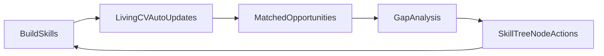
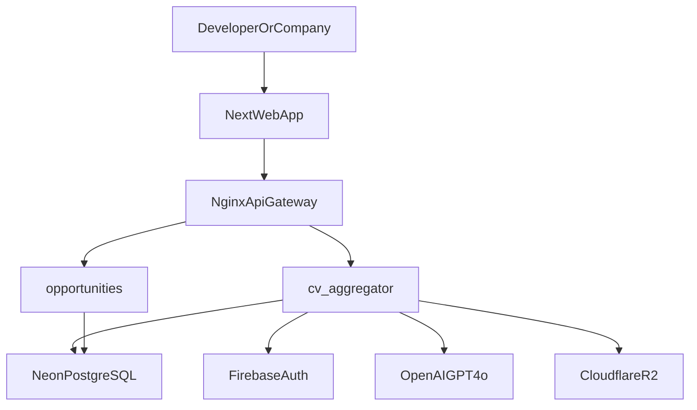

# TECHub MVP Master Guide

## Product Identity

- **Product:** TECHub
- **Tagline:** The Global Tech Talent Exchange - Started in Saudi Arabia, Built for the World.
- **University:** King Saud University
- **Course:** SWE-444 Capstone
- **Date:** February 2026
- **Core Team:** Haitham (Lead), Dev 1, Dev 2, Dev 3, Dev 4

## What TECHub Is

TECHub is a proof-based developer growth and hiring platform. Instead of keyword CV filtering, skills are validated through integrations, scored continuously, and linked to opportunities with a closed improvement loop.

### Core MVP Loop

## What TECHub Is Not

- Not a general-purpose chatbot product.
- Not a generic job board based on keyword matching.
- Not a static portfolio host with self-claims only.
- Not a subscription lock for developers; it is tokenized usage.

## MVP System Map (Whole Project)

### Repository Top-Level Purpose

- `apps/` - client-facing applications.
- `services/` - backend microservices and APIs.
- `packages/` - shared contracts/utilities across apps/services.
- `docs/` - active MVP operating docs.
- `nginx/` - gateway/reverse-proxy config.
- `scripts/` - utility scripts for repo operations.

### Application Layer

- `apps/web/` - Next.js frontend (auth, onboarding, profile, opportunities views).

### Service Layer

- `services/cv-aggregator/` - primary MVP service (auth, onboarding, CV, integrations, import).
- `services/opportunities/` - opportunities and gap-analysis APIs.

### Shared Packages

- `packages/types/` - shared types/interfaces.
- `packages/utils/` - shared helpers.
- `packages/config/` - shared config conventions.
- `packages/shared/` - common shared code.

## MVP Technology Stack

### Frontend

- Next.js 15
- TypeScript 5.x
- Tailwind CSS v4
- shadcn/ui
- Framer Motion

### Backend

- Python 3.12
- FastAPI
- Pydantic v2
- SQLAlchemy 2.x
- Alembic

### Data + Infra

- Neon PostgreSQL
- Upstash Redis
- Cloudflare R2

### Platform Integrations

- Firebase Auth
- OpenAI GPT-4o
- Stagehand (Browserbase)
- Stripe

### Deployment

- Vercel (frontend)
- Railway (services)
- Cloudflare (CDN/edge)

## Architecture Overview

## MVP Data Model (Active Core)

The active MVP direction centers on evidence-backed CV and matching entities:

- `users`
- `platform_connections`
- `projects`
- `skills`
- `skill_evidence`
- `experiences`
- `certificates`
- `competitions`
- `skill_tags_catalog`
- `user_skill_tags`

## Version Roadmap (MVP -> V3)

### MVP - Living CV + Core Loop (Month 1-2)

- Must-have product loop: proof collection -> score -> CV -> opportunity matching -> gap closure.
- Core modules: auth, onboarding, platform integrations, import center, scoring engine, living CV, opportunities, gap analysis, and tracker.
- Sprint arc from infra bootstrap to production readiness.

### V0 - Gamification + Skill Tree (Post-MVP Expansion)

- RPG identity: class system, level progression, badges.
- XP economy from proof actions (connect, verify, apply, interview, hire, quests).
- Skill Tree with prerequisite-based progression and auto-completion from verified evidence.
- Multi-scope leaderboard (global/country/university/skill/class/weekly/all-time).
- Achievements, daily quests, streak systems.

### V1 - Company Portal + Events & Training OS

- Company registration, paid access, proof-based talent discovery.
- Direct posting and partnership operations.
- Full event lifecycle platform for universities/training providers/companies (before/during/after event).
- Monetization expansion: subscriptions + paid-event revenue share.

### V2 - IDE Teacher + Learning Agent

- In-browser IDE experience from Skill Tree nodes.
- AI teaching agent with guided progression.
- Auto-push project outputs to GitHub and auto-update CV/Skill Tree/XP.
- Structured IDE quests tied to real project outcomes.

### V3 - Community + Startup OS + Multi-Agent

- Startup idea posting, co-founder matching, and shared project rooms.
- Multi-agent team support (CTO/PM/Design/Market/QA).
- Market intelligence and investor connection layer.
- Controlled project-centric chat introduced only inside project rooms.

## End-State Vision

From "I know nothing about programming" to "I have a funded startup", TECHub supports each stage of the tech journey inside one platform, beginning in Saudi Arabia and designed for global talent mobility.
